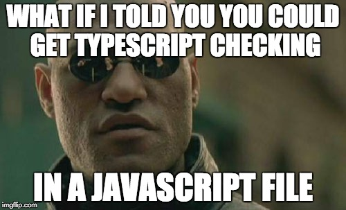

In a world where JavaScript is arguably the [most popular](https://insights.stackoverflow.com/survey/2017#technology) tool for building software these days, it seems like it's everywhere now. With node.js, it's on the backend, with Electron it's native on your machine, with React Native, it's native on your phone. There's no doubt that JavaScript is nothing but at least pervasive across so many ecosystems.

So, the next question I have is, if JavaScript is so popular, then TypeScript by nature of what is is, also should be popular. After all, in case you didn't realize it...

> Any JavaScript you can possibly write which is at least ECMA stage 3 is valid TypeScript.


### VSCode

First and foremost, if you're not using Visual Studio Code to write JavaScript, you should be, so [go get it](https://code.visualstudio.com/), and also go get [all this stuff](http://vscodecandothat.com/) from [Burke Holland](https://twitter.com/burkeholland).

Under the covers, the TypeScript compiler will do a lot of amazing things for you without you even having to think twice about it. The reason it's able to do this is, VS Code is running your JavaScript through the TypeScript compiler whether you know it or not!

https://github.com/Microsoft/TypeScript/wiki/JavaScript-Language-Service-in-Visual-Studio

On top of that, it also uses something called Automatic Type Definitions using the phenomenal [Definitely Typed](https://github.com/DefinitelyTyped/DefinitelyTyped) library of type definitions to automatically download types for thousands of popular JavaScript libraries.

### From JS to TS, TypeScript's got you
In the following example, we're simply formatting a price string.

```ts
const formatPrice = (num, symbol = "$") =>
  `${symbol}${num.toFixed(2)}`;

formatPrice("1234");
```

It could be easy to forget that if pass a string here, this function will asplode because `toFixed` doesn't exist on a string.

Simply adding types can save you runtime bugs...

```ts
const formatPrice = (num: number, symbol = "$": string) =>
  `${symbol}${num.toFixed(2)}`;

formatPrice("1234"); // num.toFixed is not a function
```

But, there's even better news...



You may or may not already be a big user of JSDoc, but if you are, you will be pleased as punch to know that as of a recent version of TypeScript, you can add `// @ts-check` to the top of a JavaScript file, and get typechcking in it!

```js
// @ts-check

/**
 * Format a price
 * @param num {number} The price
 * @param symbol {string} The currency symbol
 */
const formatPrice = (num, symbol = "$") => `${symbol}${num.toFixed(2)}`;

formatPrice("1234");
```


Here's more info about what all you can do with JSDoc... https://github.com/Microsoft/TypeScript/wiki/JSDoc-support-in-JavaScript

With VSCode you can enable full type typechecking with the following User Settings option...

```ts
"javascript.implicitProjectConfig.checkJs": true
```

### React
Cool thing is, TypeScript also supports React out of the box by adding the following to your tsconfig...

```json
{
  "jsx": "react"
}
```

Now for the real fun...


PropTypes are a great way to catch runtime React bugs. But the frustrating thing about them is, you don't know if something is broken generally until your app builds, the browser or hot loading reloads, and you see a cryptic red error message in the console.

Wouldn't it be nice to just catch that bug while working on the component?

```ts
import * as React from "react";
import formatPrice from "../utils/formatPrice";

export interface IPriceProps  {
  num: number;
  symbol: "$" | "€" | "£";
}

const Price: React.SFC<IPriceProps> = ({
  num,
  symbol,
}: IPriceProps) => (
  <div>
    <h3>{formatPrice(num, symbol)}</h3>
  </div>
);
```

Now, check this out...


It's amazing to be able to get intellisense on props. You can start typing, or in VSCode hit Control + Space to pull open the Intellisense menu.

You can even get intellisense on React classes as well...


### Conclusion
Whether or not you decide to go full on TypeScript, it's clear you can see many benefits even if you stick with pure JavaScript.
